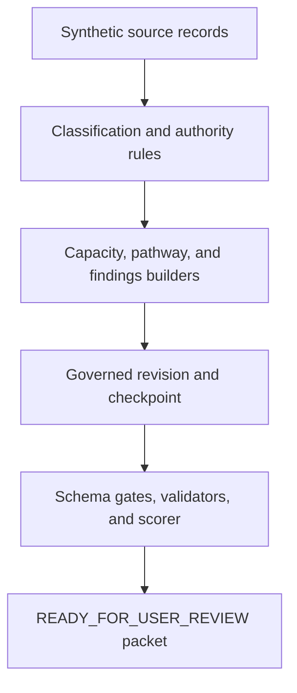

# Technical Architecture

## Runtime flow

## Components

| Layer | Repository component | Responsibility |
| --- | --- | --- |
| Plugin | `.codex-plugin/plugin.json` | Makes the Neverlost skill set discoverable as one package. |
| Governed review skill | `skills/neverlost-review-workflow/` | Protects source custody, boundaries, review lanes, revision control, and checkpoints. |
| Full Human Pathway skill | `skills/full-human-pathway/` | Maps active lanes, responsible systems, dependencies, proper authority, and bounded next actions. |
| Capacity & Output skill | `skills/capacity-output/` | Keeps completed activity attached to conditions, accommodations, constraints, variability, and recovery. |
| Data contracts | `schemas/` | Defines the required repository subset for intake, sources, capacity, pathways, findings, checkpoints, and run manifests. |
| Case-neutral engine | `scripts/neverlost_core.py` | Classifies sources, extracts bounded observations, builds pathways, detects unsafe transformations, and drafts governed outputs. |
| Runner | `scripts/run_workflow.py` | Converts one authorized fixture into the review packet. |
| Validator | `scripts/validate_packet.py` | Enforces schemas, source set, privacy, recovery, lanes, findings, prohibited claims, attribution, and status. |
| Frozen scorer | `scripts/score_stage3_retest.py` | Scores ten planted defects, classification accuracy, false positives, and qualitative gates. |
| Demo runner | `scripts/run_stage4_demo.py` | Rebuilds the distinct case in a temporary directory and reports the validated evidence. |
| Regression suite | `tests/` | Protects Stage 1, Stage 2, Stage 3, negative-claim blocking, and source-fidelity behavior. |

## Design choices

### Human authority stays explicit

Provider, client, OT, historical, vocational, benefits, and Neverlost-draft statements receive different source-authority labels. A derived packet may organize them but cannot borrow their authority.

### The runtime is deterministic

The current prototype runs locally without an API call. That makes the synthetic demonstration inexpensive, reproducible, and easy to audit. Codex supported the design, implementation, testing, and governed patch process; the committed demo does not depend on an unrepeatable model response.

### Capacity is not inferred from output alone

The capacity record retains duration, observation count, accommodations, constraints, recovery, repeatability, and prohibited conclusions. The Stage 3 patch specifically prevents a separate OT simulation from being silently merged into the client activity count.

### Success is measured before polishing

The second-case answer key was frozen before the engine was generalized. The first packet was committed before validation and scoring, and it remains separate from the patched final packet.

## Current limitations

- The detection engine is a bounded rule-based prototype, not general-purpose natural-language understanding.
- Only two fictional cases have been validated.
- The repository validates the JSON-Schema subset it uses; it is not presented as a complete production schema platform.
- No authenticated service, database, UI, deployment, marketplace install, or real-client workflow has been tested.
- Professional conclusions and external decisions remain outside Neverlost authority.
